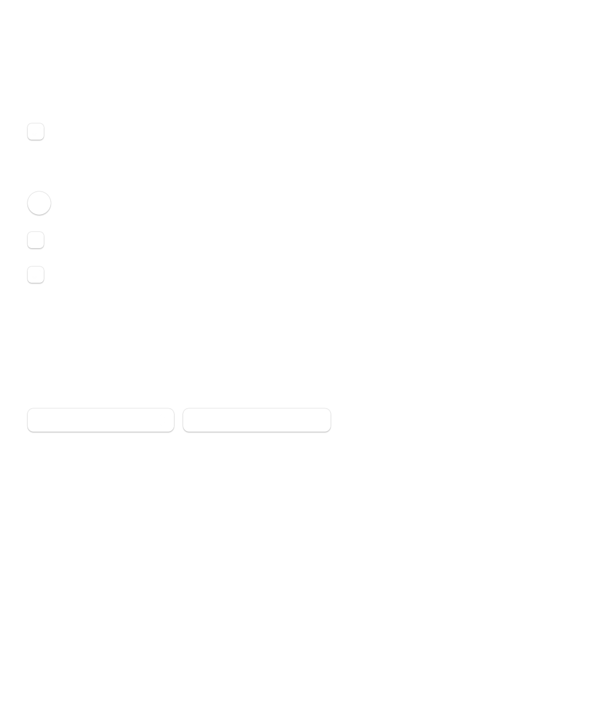
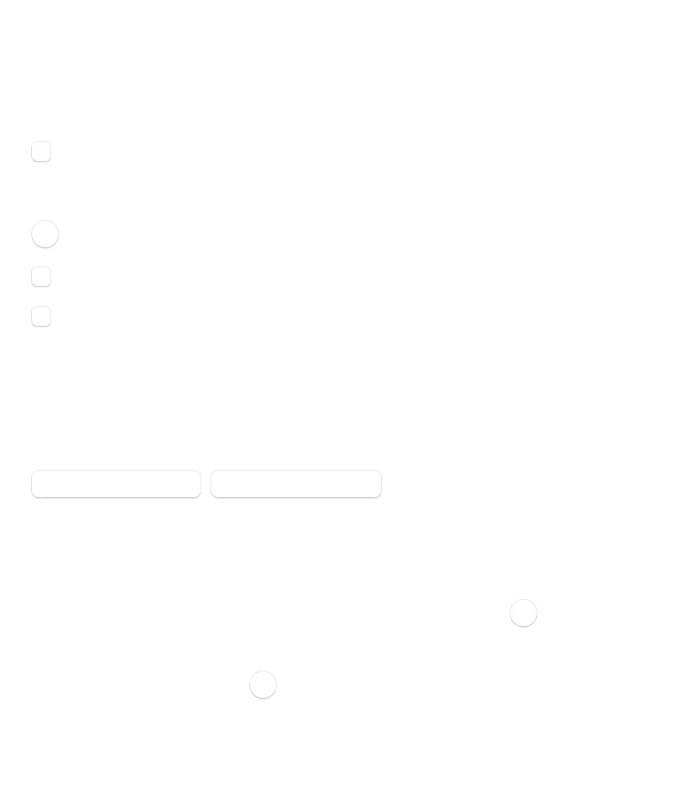

# VolumeGuard 0.2.0 体验审计

## 审计范围

- 用户目标：确认保护是否正在生效，调整默认上限，并为会议/音乐 App 配置不同上限。
- 可访问性目标：关键状态可读、控件标签清楚、键盘可达、文字不被裁切。
- 捕获环境：macOS 14.2.1 深色模式，App 自有视图渲染；菜单栏弹出菜单因当前进程没有屏幕录制权限，无法取得可接受截图。

## Step 1：首次打开设置 — 需优化

优点：隐私说明、20% 默认上限和设备兼容边界都能看到；使用原生控件，没有额外视觉依赖。

问题：保护是否真正生效、当前设备、当前音量和生效规则都没有在设置页呈现；所有内容挤在一个长表单里，默认设置与高级 App 规则没有清楚分层；“前台 App”这一重要限制藏在一段较长说明中。空规则区域占据较大高度，但主要操作“添加 App”不够突出。

可访问性风险：次要 Bundle ID 使用 9pt 字号；多处长句增加认知负担；截图无法验证 VoiceOver 顺序和完整键盘导航。

## Step 2：配置两条 App 规则 — 不健康

问题：规则列表增加后，通用设置整体被挤出窗口，只剩底部规则可见。这是结构性布局错误，不是视觉润色问题。用户也无法暂停一条规则，只能调整或删除，模型中的 `isEnabled` 能力没有暴露。添加入口只支持正在运行的 App，无法提前配置尚未启动的 Music、Zoom 等应用。

可访问性风险：页面裁切使键盘焦点可能落到不可见控件；移除按钮缺少清楚的文字/辅助说明证据；规则状态无法感知。

## Step 3：菜单栏保护与暂停 — 有限证据

行为和代码检查确认菜单支持保护开关、暂停 15 分钟/1 小时/手动恢复、最近保护记录、设置和退出。当前捕获环境无法取得非黑屏的系统菜单截图，因此不对视觉层级或对比度作截图结论。

机会：显示生效规则来源；直接为当前前台 App 添加/编辑规则；设备不支持时提供明确下一步。

## 0.3.0 优先级

1. 修复设置窗口延迟加载崩溃和规则导致的裁切。
2. 将“通用”与“App 规则”拆成两个轻量页面，增加当前保护状态摘要。
3. 支持从正在运行的 App 或 Finder 选择任意 `.app`，并允许临时停用规则。
4. 菜单栏增加生效规则来源及当前 App 快捷规则入口。
5. 缓存输出设备的名称、声道数和可调能力，减少每次音量事件的 HAL 查询。
6. 保持设置窗口按需创建、事件驱动监听和关闭后释放资源。
