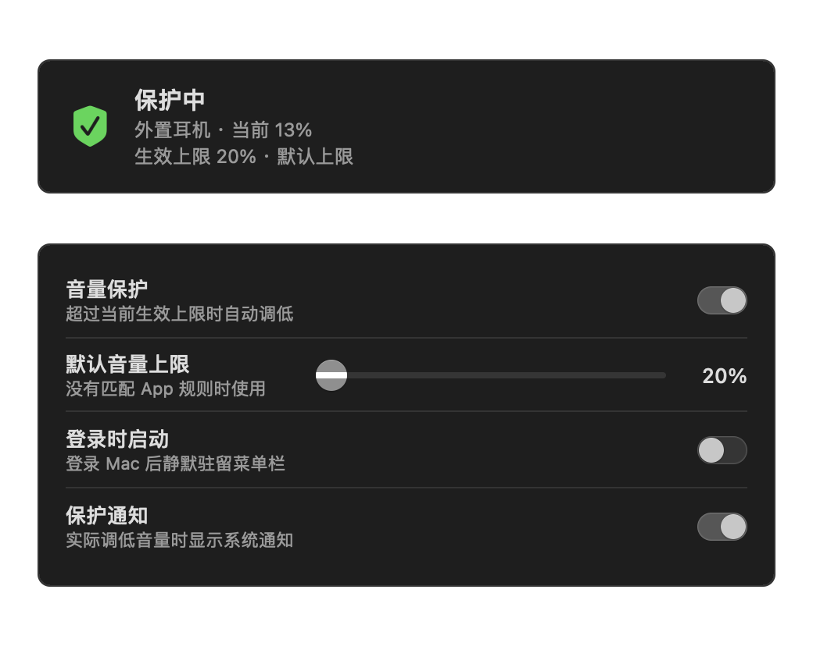
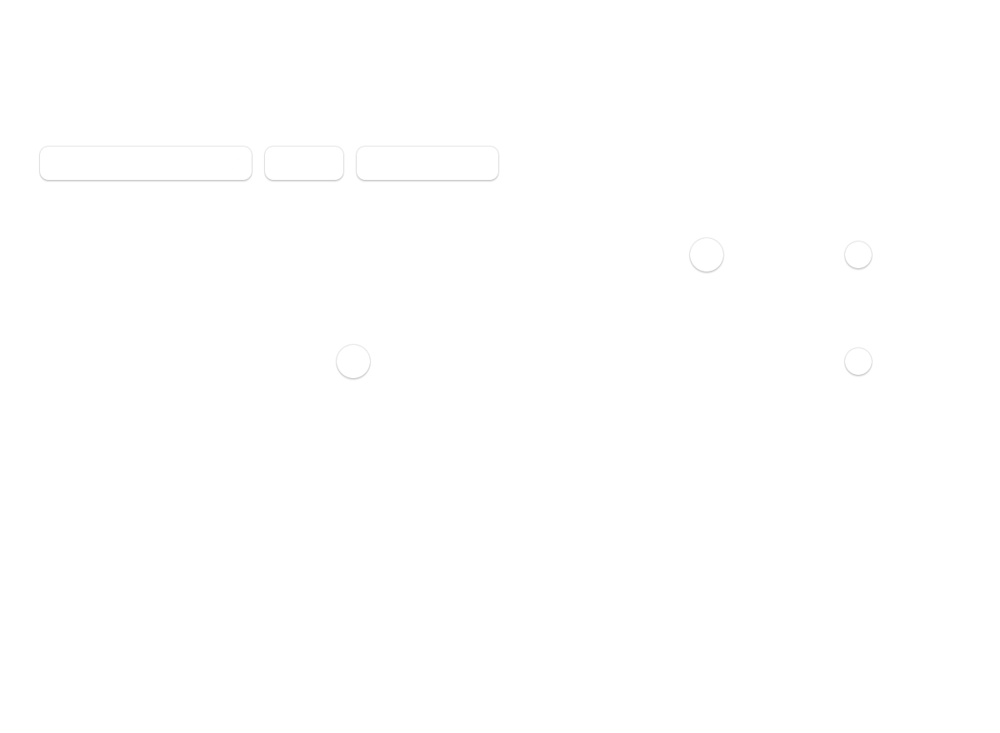

# VolumeGuard 0.3.0 体验复核

## Step 1：通用设置 — 健康

- 当前保护状态、输出设备、当前音量、生效上限和规则来源集中在首屏顶部。
- 保护、默认上限、登录启动和通知使用分组设置行；20% 默认值与隐私边界保持可见。
- 设置窗口采用不可自定义的 macOS 偏好设置工具栏，通用与 App 规则分别成 pane，窗口随 pane 调整尺寸。
- 开关和滑杆均提供辅助功能标签；完整 VoiceOver 朗读顺序仍需人工验证。

## Step 2：App 规则 — 健康

- 规则固定从列表顶部排列，两条规则不会再裁切页面说明或操作入口。
- 支持运行中 App、Finder 选择任意 App、单条规则启停、上限调整和移除。
- “当前前台 App”触发边界独立成行，不再埋在长段落中。
- 10pt Bundle ID 比旧版 9pt 更易读；滑杆和开关有按 App 命名的辅助功能标签。

## Step 3：菜单栏快捷操作 — 行为健康，视觉证据有限

- 菜单新增生效规则来源，以及“为当前 App 添加规则…”或“编辑当前 App 规则…”。
- 设置项保持 `Command-,`，保护、暂停、恢复和立即检查仍可直接操作。
- 当前机器未授权屏幕录制，系统弹出菜单无法生成可接受截图，因此没有对其视觉对比度作截图结论。

## 对比结论

- 0.2.0 的设置延迟加载会在首次打开时崩溃，0.3.0 已修复并由 Launch Services UI 烟雾测试覆盖。
- 0.2.0 的多规则状态会把通用设置挤出窗口，0.3.0 通过独立 pane 与固定高度规则列表消除裁切。
- 0.3.0 沿用系统字体、动态颜色、标准工具栏、开关、滑杆、弹出按钮和 Finder 选择器，没有引入自定义视觉资产或第三方 UI。

## 证据限制

AppKit 的离屏截图不会完整绘制部分标准按钮标题和窗口工具栏；截图用于验证内容层级、尺寸、分组与裁切，按钮文字和工具栏选中态还需在实际窗口中人工复核。未从截图推断完整 WCAG 或 VoiceOver 合规。
